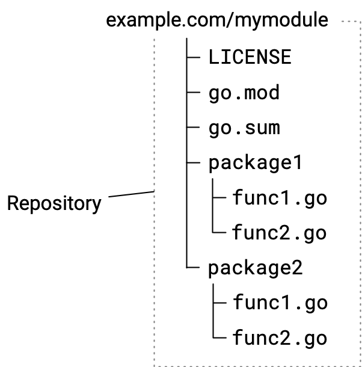
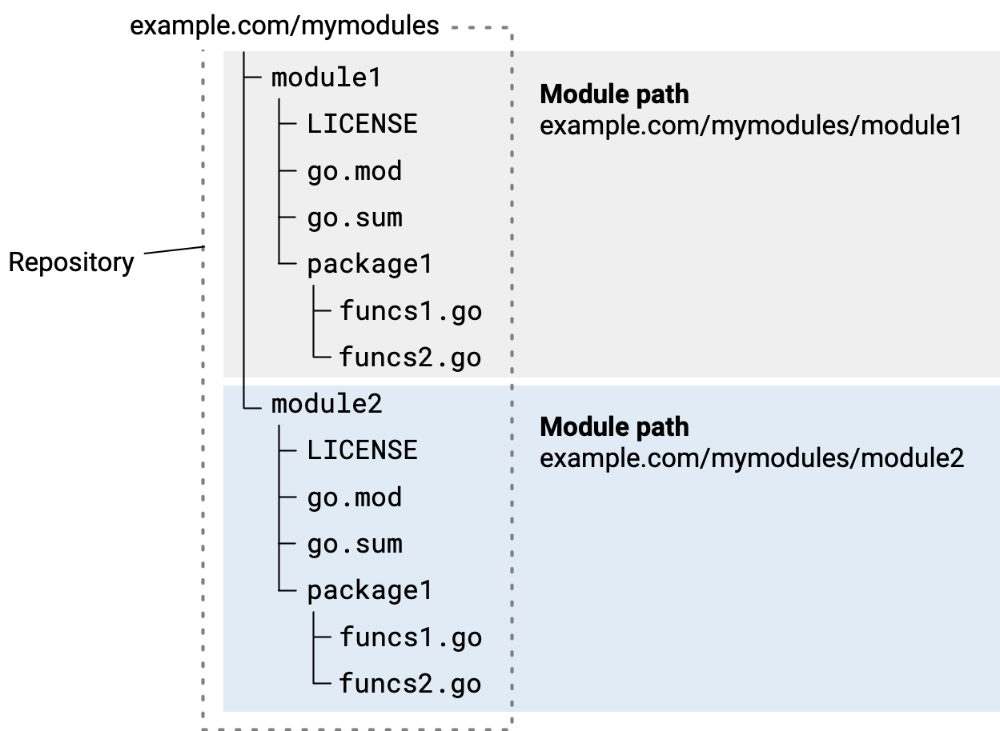

## 🗂️ Modül Kaynağını Yönetme

### 📑 İçindekiler

* Go araçları yayınladığınız modülü nasıl bulur
* Depoda kodu organize etme
* Depo kapsamını seçme
* Depo başına tek modül kaynaklama
* Tek bir depoda birden çok modül kaynaklama

Başkalarının kullanması için yayınlayacağınız modülleri geliştirirken, bu konuda açıklanan depo konvansiyonlarını izleyerek modüllerinizin diğer geliştiriciler tarafından daha kolay kullanılmasını sağlamaya yardımcı olabilirsiniz.

Bu konu, modül deponuzu yönetirken atabileceğiniz adımları açıklar. Sürümden sürüme revize ederken izleyeceğiniz iş akışı adımları dizisi hakkında bilgi için ***Modül yayınlama ve sürümleme iş akışı*** konusuna bakın.

Burada açıklanan konvansiyonların bazıları modüllerde zorunludur, bazıları ise en iyi uygulamalardır. Bu içerik, ***Bağımlılıkları yönetme*** bölümünde anlatılan temel modül kullanım pratiklerine aşina olduğunuzu varsayar.

Go, modül yayınlamak için şu depoları destekler: Git, Subversion, Mercurial, Bazaar ve Fossil.

Modül geliştirmeye genel bir bakış için ***Modülleri geliştirme ve yayınlama*** konusuna bakın.

---

## 🔎 Go Araçları Yayınladığınız Modülü Nasıl Bulur

Go’nun modülleri yayınlama ve kodlarını alma için merkeziyetsiz sisteminde, kodu deponuzda bırakırken modülünüzü yayınlayabilirsiniz. Go araçları, bir modülün adını ve sürüm numarasını belirten depo yolları ve depo etiketlerini (tag) içeren adlandırma kurallarına dayanır. Deponuz bu gereksinimleri karşıladığında, modül kodunuz **`go get`** komutu gibi Go araçları tarafından deponuzdan indirilebilir.

Bir geliştirici, kodunun import ettiği paketler için kaynak kodu almak amacıyla **`go get`** komutunu kullandığında, komut şunları yapar:

* Go kaynak kodundaki import ifadelerinden, paket yolu içindeki modül yolunu (module path) belirler.
* Modül yolundan türetilen bir URL kullanarak, modül kaynağını bir modül proxy sunucusunda veya doğrudan deposunda bulur.
* İndirilecek modül sürümünün kaynağını, modülün sürüm numarasını depodaki bir etiketle (tag) eşleştirerek depodaki kodu keşfeder. Kullanılacak sürüm numarası henüz bilinmiyorsa, **`go get`** en son yayın (release) sürümünü bulur.
* Modül kaynağını alır ve geliştiricinin yerel modül önbelleğine indirir.

---

## 🧱 Depoda Kodu Organize Etme

Burada açıklanan konvansiyonları izleyerek bakım işlerini basit tutabilir ve modülünüzle ilgili geliştirici deneyimini iyileştirebilirsiniz. Modül kodunuzu bir depoya koymak, genellikle diğer kodlarda olduğu gibi basittir.

Aşağıdaki diyagram, iki paket içeren basit bir modül için bir kaynak hiyerarşisini göstermektedir.

Basit bir modül için kaynak kod hiyerarşisini gösteren diyagram



İlk commit’iniz, aşağıdaki tabloda listelenen dosyaları içermelidir:

| Dosya                                | Açıklama                                                                                                                                                                                                                                                                                                       |
| ------------------------------------ | ---------------------------------------------------------------------------------------------------------------------------------------------------------------------------------------------------------------------------------------------------------------------------------------------------------------- |
| **LICENSE**                    | Modülün lisansı.                                                                                                                                                                                                                                                                                              |
| **go.mod**                     | Modülü tanımlar; modül yolunu (fiilen adı) ve bağımlılıklarını içerir. Daha fazlası için***go.mod başvurusu***na bakın.                                                                                                                                                                  |
|                                      | Modül yolu, örneğin şu tür bir*module*yönergesinde verilir:                                                                                                                                                                                                                                              |
|                                      | `module example.com/mymodule`                                                                                                                                                                                                                                                                                  |
|                                      | Modül yolu seçimi hakkında daha fazlası için***Bağımlılıkları yönetme***konusuna bakın.                                                                                                                                                                                                      |
|                                      | **`go.mod`**dosyasını düzenleyebilseniz de, değişiklikleri** `go`**komutları üzerinden yapmak daha güvenilirdir.                                                                                                                                                                               |
| **go.sum**                     | Modülün bağımlılıklarını temsil eden kriptografik hash’leri içerir. Go araçları bu hash’leri indirilen modülleri doğrulamak için kullanır ve indirilen modülün özgün (authentic) olduğunu teyit etmeye çalışır. Bu doğrulama başarısız olursa, Go bir güvenlik hatası gösterir. |
|                                      | Dosya, bağımlılık yoksa boş olur veya hiç bulunmaz. Gereksiz girdileri kaldıran**`go mod tidy`**komutu dışında bu dosyayı düzenlememelisiniz.                                                                                                                                                      |
| Paket dizinleri ve**.go**kaynakları | Modüldeki Go paketlerini ve kaynaklarını oluşturan dizinler ve**.go**dosyaları.                                                                                                                                                                                                                             |

Komut satırından, boş bir depo oluşturabilir, ilk commit’inizin parçası olacak dosyaları ekleyebilir ve bir mesajla commit edebilirsiniz. İşte **git** kullanan bir örnek:

```bash
$ git init
$ git add --all
$ git commit -m "mycode: initial commit"
$ git push
```

---

## 🎯 Depo Kapsamını Seçme

Bir modülde kodu, kodun diğer modüllerdeki koddan bağımsız olarak sürümlenmesi gerektiğinde yayınlarsınız.

Deponuzu, kök dizininde tek bir modül barındıracak şekilde tasarlamak, özellikle zaman içinde yeni minor ve patch sürümleri yayınladıkça, yeni major sürümlere dallandıkça vb. bakım işlerini daha basit tutmaya yardımcı olur. Ancak ihtiyaçlarınız gerektiriyorsa, bunun yerine tek bir depoda bir modül koleksiyonunu da sürdürebilirsiniz.

---

## 🧩 Depo Başına Tek Modül Kaynaklama

Tek bir modülün kaynağını içeren bir depo sürdürebilirsiniz. Bu modelde **`go.mod`** dosyasını depo köküne yerleştirir, altında Go kaynaklarını içeren paket alt dizinleri bulundurursunuz.

Bu en basit yaklaşımdır; modülünüzün zaman içinde yönetilmesini muhtemelen daha kolay hâle getirir. Bir modül sürüm numarasını bir dizin yoluyla ön eklemeye (prefix) ihtiyaç duymaktan kaçınmanıza yardımcı olur.

Depoda tek bir modülün kaynağını gösteren diyagram


---

## 🧱 Tek Bir Depoda Birden Çok Modül Kaynaklama

Tek bir depodan birden fazla modül yayınlayabilirsiniz. Örneğin, tek bir depodaki kod birden fazla modül oluşturuyor olabilir, ancak bu modülleri ayrı ayrı sürümlemek isteyebilirsiniz.

Modül kök dizini olan her alt dizinin kendi **`go.mod`** dosyası olmalıdır.

Modül kodunu alt dizinlerde kaynaklamak, bir modülü yayınlarken kullanmanız gereken sürüm etiketinin (version tag) biçimini değiştirir. Bir modülü yayınlarken, etiketin sürüm numarası kısmına modül kökü olan alt dizinin adını ön ek olarak eklemelisiniz. Sürüm numaraları hakkında daha fazlası için ***Modül sürüm numaralandırma*** konusuna bakın.

Örneğin, aşağıdaki **`example.com/mymodules/module1`** modülü için, **`v1.2.3`** sürümünde şu değerler olur:

* Modül yolu (module path): `example.com/mymodules/module1`
* Sürüm etiketi (version tag): `module1/v1.2.3`
* Bir kullanıcının import ettiği paket yolu: `example.com/mymodules/module1/package1`
* Bir kullanıcının **`require`** yönergesinde belirttiği modül yolu ve sürüm: `example.com/mymodules/module1 v1.2.3`

Tek bir depoda iki modülü gösteren diyagram


