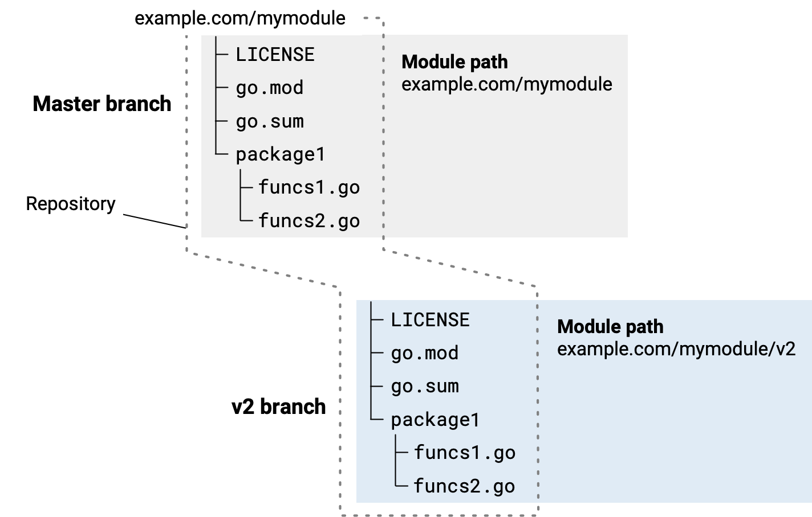

## 🧱 Büyük Sürüm (Major) Güncellemesi Geliştirme

### 📑 İçindekiler

* Büyük sürüm güncellemesi için dikkate alınacaklar
* Büyük bir yayın için dallanma (branching)

Yapmayı planladığınız yeni bir sürümdeki değişiklikler, modülün kullanıcıları için geriye dönük uyumluluğu garanti edemiyorsa, bir üst **major** sürüme güncelleme yapmanız gerekir. Örneğin, modülünüzün  *public API* ’sini önceki sürümleri kullanan istemci kodunu bozacak şekilde değiştirirseniz bu değişikliği yaparsınız.

Not: Her yayın türü –  **major** ,  **minor** , **patch** veya **ön sürüm (pre-release)** – modülünüzün kullanıcıları için farklı bir anlama sahiptir. Kullanıcılar, bir yayının kendi kodları için temsil ettiği risk düzeyini anlamak adına bu farklara güvenir. Başka bir ifadeyle, bir yayın hazırlarken, sürüm numarasının önceki yayından bu yana yapılan değişikliklerin niteliğini doğru şekilde yansıttığından emin olun. Sürüm numaraları hakkında daha fazla bilgi için ***Modül sürüm numaralandırma*** konusuna bakın.

---

## 🔎 Ayrıca bakınız

* Modül geliştirmeye genel bir bakış için ***Modülleri geliştirme ve yayınlama*** konusuna bakın.
* Uçtan uca bir görünüm için ***Modül yayınlama ve sürümleme iş akışı*** konusuna bakın.

---

## ⚖️ Büyük Sürüm Güncellemesi İçin Dikkate Alınacaklar

Yeni bir major sürüme yalnızca kesinlikle gerekli olduğunda geçmelisiniz. Bir major sürüm güncellemesi hem sizin hem de modülünüzün kullanıcıları için önemli bir değişim yükü (churn) anlamına gelir. Major sürüm güncellemesi düşünürken şunları göz önünde bulundurun:

* Yeni major sürümü yayınlamanın, önceki major sürümleri desteklemeniz açısından ne anlama geldiğini kullanıcılarınıza açıkça belirtin.
* Önceki sürümler kullanım dışı mı (deprecated)? Daha önce olduğu gibi destekleniyor mu? Önceki sürümleri, hata düzeltmeleri dahil, bakımını sürdürecek misiniz?
* İki sürümün bakımını üstlenmeye hazır olun: eski ve yeni. Örneğin birinde hata düzeltmesi yaptığınızda, çoğu zaman bu düzeltmeleri diğerine de taşıyor olacaksınız.
* Yeni bir major sürümün, bağımlılık yönetimi açısından yeni bir modül olduğunu unutmayın. Kullanıcılarınız, yayınladıktan sonra yalnızca yükseltme yapmak yerine, yeni bir modülü kullanmak için güncelleme yapmak zorunda kalacaktır.
* Bunun nedeni, yeni bir major sürümün, önceki major sürümden farklı bir modül yoluna ( *module path* ) sahip olmasıdır. Örneğin modül yolu `example.com/mymodule` olan bir modülde, **`v2`** sürümü `example.com/mymodule/v2` modül yoluna sahip olacaktır.
* Yeni bir major sürüm geliştirirken, kodun yeni modülden paketleri import ettiği her yerde import yollarını da güncellemeniz gerekir. Modülünüzün kullanıcıları da yeni major sürüme yükseltmek istiyorlarsa kendi import yollarını güncellemek zorundadır.

---

## 🌿 Büyük Bir Yayın İçin Dallanma (Branching)

Yeni bir major sürüm geliştirmeye hazırlanırken kaynağı yönetmenin en doğrudan yaklaşımı, deponuzu önceki major sürümün en son sürümünde dallandırmaktır.

Örneğin, bir komut isteminde modülünüzün kök dizinine geçip orada yeni bir **`v2`** dalı (branch) oluşturabilirsiniz.

```bash
$ cd mymodule
$ git checkout -b v2
Switched to a new branch "v2"
```

Master’dan `v2` dalına ayrılmış bir depoyu gösteren diyagram



Kaynağı dallandırdıktan sonra, yeni sürümünüzün kaynağında aşağıdaki değişiklikleri yapmanız gerekir:

* Yeni sürümün **`go.mod`** dosyasında, modül yoluna yeni major sürüm numarasını ekleyin; aşağıdaki örnekte olduğu gibi:

```text
Mevcut sürüm: example.com/mymodule
Yeni sürüm: example.com/mymodule/v2
```

* Go kodunuzda, modülden bir paket import ettiğiniz her import edilen paket yolunu güncelleyerek, modül yolu kısmına major sürüm numarasını ekleyin.

```go
Eski import ifadesi: import "example.com/mymodule/package1"
Yeni import ifadesi: import "example.com/mymodule/v2/package1"
```

Yayınlama adımları için ***Bir modül yayınlama*** konusuna bakın.
