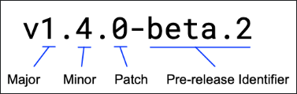

## 🏷️ Modül Sürüm Numaralandırma

### 📑 İçindekiler

* Geliştirme aşamasında
* Pseudo-sürüm numarası
* v0 numarası
* Ön sürüm (pre-release) sürümü
* Minor sürüm
* Patch sürüm
* Major sürüm

Bir modülün geliştiricisi, modül sürüm numarasının her bir parçasını sürümün kararlılığını ve geriye dönük uyumluluğunu işaret etmek için kullanır. Her yeni yayında, modülün yayın sürüm numarası özellikle bir önceki yayından bu yana yapılan değişikliklerin niteliğini yansıtır.

Harici modülleri kullanan kod geliştirirken, bir yükseltmeyi değerlendirirken harici bir modülün kararlılığını anlamak için sürüm numaralarını kullanabilirsiniz. Kendi modüllerinizi geliştirirken ise sürüm numaralarınız, modüllerinizin kararlılığını ve geriye dönük uyumluluğunu diğer geliştiricilere işaret eder.

Bu konu, modül sürüm numaralarının ne anlama geldiğini açıklar.

---

## 🔎 Ayrıca bakınız

Kodunuzda harici paketleri kullanırken, bu bağımlılıkları Go araçlarıyla yönetebilirsiniz. Daha fazlası için ***Bağımlılıkları yönetme*** konusuna bakın.

Başkalarının kullanması için modüller geliştiriyorsanız, modülü yayınlarken bir sürüm numarası uygular ve modülü deposunda etiketlersiniz (tag). Daha fazlası için ***Bir modül yayınlama*** konusuna bakın.

Yayınlanan bir modül, aşağıdaki görselde olduğu gibi semantik sürümleme modelinde bir sürüm numarasıyla yayınlanır:

Semantik bir sürüm numarasını gösteren diyagram: major sürüm 1, minor sürüm 4, patch sürüm 0 ve ön sürüm beta 2



Aşağıdaki tablo, bir sürüm numarasının parçalarının bir modülün kararlılığını ve geriye dönük uyumluluğunu nasıl işaret ettiğini açıklar.

| Sürüm aşaması                   | Örnek                                       | Geliştiricilere mesaj                                                                                                                                                     |
| ----------------------------------- | -------------------------------------------- | -------------------------------------------------------------------------------------------------------------------------------------------------------------------------- |
| Geliştirme aşamasında            | Otomatik pseudo-sürüm numarası `v0.x.x` | Modülün hâlâ geliştirme aşamasında ve kararsız olduğunu işaret eder. Bu yayın, geriye dönük uyumluluk veya kararlılık garantisi taşımaz.                  |
| Major sürüm                       | `v1.x.x`                                   | Geriye dönük uyumsuz*public API*değişikliklerini işaret eder. Bu yayın, önceki major sürümlerle geriye dönük uyumlu olacağına dair garanti taşımaz.       |
| Minor sürüm                       | `vx.4.x`                                   | Geriye dönük uyumlu*public API*değişikliklerini işaret eder. Bu yayın, geriye dönük uyumluluk ve kararlılık garantisi verir.                                   |
| Patch sürüm                       | `vx.x.1`                                   | Modülün*public API* ’sini veya bağımlılıklarını etkilemeyen değişiklikleri işaret eder. Bu yayın, geriye dönük uyumluluk ve kararlılık garantisi verir. |
| Ön sürüm (pre-release) sürümü | `vx.x.x-beta.2`                            | *Alpha*veya*beta*gibi bir ön sürüm kilometre taşını işaret eder. Bu yayın, kararlılık garantisi taşımaz.                                                   |

---

## 🧪 Geliştirme Aşamasında

Modülün hâlâ geliştirme aşamasında ve kararsız olduğunu işaret eder. Bu yayın, geriye dönük uyumluluk veya kararlılık garantisi taşımaz.

Sürüm numarası aşağıdaki biçimlerden birini alabilir:

* Pseudo-sürüm numarası
  `v0.0.0-20170915032832-14c0d48ead0c`
* v0 numarası
  `v0.x.x`

---

## 🧾 Pseudo-Sürüm Numarası

Bir modül deposunda etiketlenmemişse, Go araçları modüldeki fonksiyonları çağıran kodun **`go.mod`** dosyasında kullanılmak üzere bir pseudo-sürüm numarası üretir.

Not: En iyi uygulama olarak, pseudo-sürüm numarasını kendiniz oluşturmak yerine her zaman Go araçlarının üretmesine izin verin.

Pseudo-sürümler, modülün fonksiyonlarını tüketen (consuming) kodu geliştiren bir geliştiricinin, henüz semantik sürüm etiketiyle etiketlenmemiş bir commit’e karşı geliştirme yapması gerektiğinde faydalıdır.

Bir pseudo-sürüm numarası, aşağıdaki biçimde gösterildiği gibi tirelerle ayrılan üç parçadan oluşur:

### 🧬 Söz dizimi (Syntax)

```text
baseVersionPrefix-timestamp-revisionIdentifier
```

### 🧩 Parçalar

* **`baseVersionPrefix`** (`vX.0.0` veya `vX.Y.Z-0`)
  Revizyondan önce gelen bir semantik sürüm etiketinden türetilen bir değerdir ya da böyle bir etiket yoksa `vX.0.0` değeridir.
* **`timestamp`** (`yymmddhhmmss`)
  Revizyonun oluşturulduğu UTC zamandır. Git’te bu, yazar (author) zamanı değil, commit zamanıdır.
* **`revisionIdentifier`** (`abcdefabcdef`)
  Commit hash’inin 12 karakterlik öneki veya Subversion’da sıfırla doldurulmuş (zero-padded) revizyon numarasıdır.

---

## 🟠 v0 Numarası

**`v0`** numarasıyla yayınlanan bir modül, major, minor ve patch parçalarına sahip resmi bir semantik sürüm numarasına ve isteğe bağlı bir ön sürüm tanımlayıcısına sahip olur.

Bir **`v0`** sürümü üretimde kullanılabilse de, kararlılık veya geriye dönük uyumluluk garantisi vermez. Buna ek olarak, **`v1`** ve sonrası sürümlerin, **`v0`** sürümlerini kullanan kod için geriye dönük uyumluluğu bozmasına izin verilir. Bu nedenle, bir **`v0`** modülündeki fonksiyonları tüketen kodu geliştiren bir geliştirici, **`v1`** yayınlanana kadar uyumsuz değişikliklere uyum sağlamaktan sorumludur.

---

## 🧷 Ön Sürüm (Pre-release) Sürümü

*Alpha* veya *beta* gibi bir ön sürüm kilometre taşını işaret eder. Bu yayın, kararlılık garantisi taşımaz.

### 📌 Örnek

`vx.x.x-beta.2`

Bir modül geliştiricisi, tire ve ön sürüm tanımlayıcısını ekleyerek herhangi bir `major.minor.patch` kombinasyonuyla ön sürüm tanımlayıcısı kullanabilir.

---

## ➕ Minor Sürüm

Modülün  *public API* ’sinde geriye dönük uyumlu değişiklikleri işaret eder. Bu yayın, geriye dönük uyumluluk ve kararlılık garantisi verir.

### 📌 Örnek

`vx.4.x`

Bu sürüm, modülün  *public API* ’sini değiştirir; ancak çağıran kodu bozacak şekilde değil. Bu, modülün kendi bağımlılıklarındaki değişiklikleri veya yeni fonksiyonlar, metotlar, *struct* alanları ya da türler eklenmesini içerebilir.

Başka bir ifadeyle, bu sürüm başka bir geliştiricinin kullanmak isteyebileceği yeni fonksiyonlar aracılığıyla iyileştirmeler içerebilir. Ancak önceki minor sürümleri kullanan bir geliştiricinin aksi halde kodunu değiştirmesine gerek yoktur.

---

## 🩹 Patch Sürüm

Modülün  *public API* ’sini veya bağımlılıklarını etkilemeyen değişiklikleri işaret eder. Bu yayın, geriye dönük uyumluluk ve kararlılık garantisi verir.

### 📌 Örnek

`vx.x.1`

Bu numarayı artıran bir güncelleme yalnızca hata düzeltmeleri gibi küçük değişiklikler içindir. Tüketici kodu geliştiren geliştiriciler, kodlarını değiştirmeye gerek kalmadan bu sürüme güvenle yükseltebilir.

---

## 🧨 Major Sürüm

Bir modülün  *public API* ’sinde geriye dönük uyumsuz değişiklikleri işaret eder. Bu yayın, önceki major sürümlerle geriye dönük uyumlu olacağına dair garanti taşımaz.

### 📌 Örnek

`v1.x.x`

**`v1`** veya üzeri bir sürüm numarası, modülün kullanım için kararlı olduğunu işaret eder (ön sürümleri hariç).

**`v0`** sürümü kararlılık veya geriye dönük uyumluluk garantisi vermediği için, bir modülü  **`v0`** ’dan  **`v1`** ’e yükselten bir geliştirici, geriye dönük uyumluluğu bozan değişikliklere uyum sağlamaktan sorumludur.

Bir modül geliştiricisi, bu yükseltmenin modülü kullanan geliştiriciler için önemli bir kesinti (disruption) temsil etmesi nedeniyle, yalnızca gerektiğinde bu numarayı  **`v1`** ’in ötesine artırmalıdır. Bu kesinti,  *public API* ’deki geriye dönük uyumsuz değişikliklerin yanı sıra, modülü kullanan geliştiricilerin modülden paket import ettikleri her yerde paket yolunu güncelleme ihtiyacını da içerir.

 **`v1`** ’den daha büyük bir sayıya major sürüm güncellemesi, aynı zamanda yeni bir modül yoluna sahip olacaktır. Bunun nedeni, modül yoluna major sürüm numarasının eklenmesidir; aşağıdaki örnekte olduğu gibi:

```text
module example.com/mymodule/v2 v2.0.0
```

Bir major sürüm güncellemesi, bunu önceki sürümden ayrı bir geçmişe sahip yeni bir modül hâline getirir. Başkalarının kullanması için modüller geliştiriyorsanız, ***Modül yayınlama ve sürümleme iş akışı*** içindeki **“Kırıcı API değişikliklerini yayınlama”** bölümüne bakın.

**`module`** yönergesi hakkında daha fazla bilgi için ***go.mod başvurusu***na bakın.
